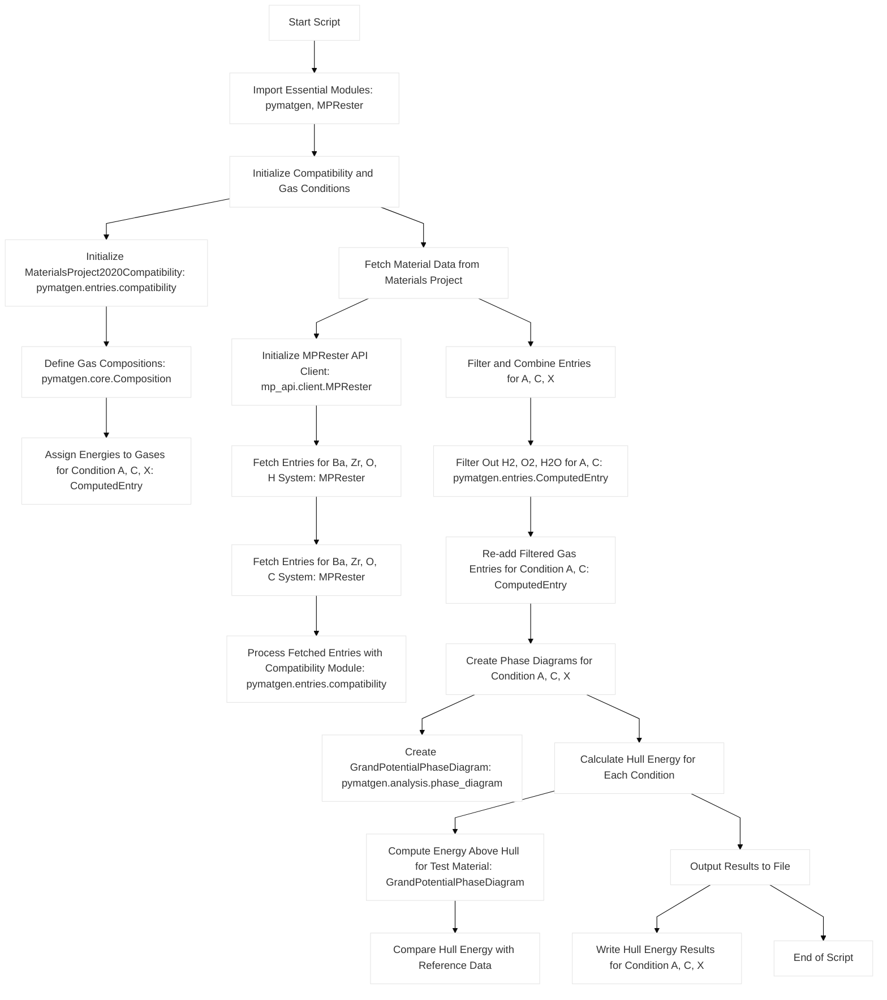

# Full Logic Structure of Python Code

```mermaid
%%{init: {'theme': 'base', 'themeVariables': { 'primaryColor': '#fff', 'edgeLabelBackground':'#f5f5f5'}, 'flowchart': { 'curve': 'linear', 'htmlLabels': false }}}%%
graph TD;
    A[Start Script] --> B[Import Essential Modules: pymatgen, MPRester];

    B --> C[Initialize Compatibility and Gas Conditions];
    C --> C1[Initialize MaterialsProject2020Compatibility: pymatgen.entries.compatibility];
    C1 --> C2[Define Gas Compositions: pymatgen.core.Composition];
    C2 --> C3[Assign Energies to Gases for Condition A, C, X: ComputedEntry];

    C --> E[Fetch Material Data from Materials Project];
    E --> E1[Initialize MPRester API Client: mp_api.client.MPRester];
    E1 --> E2[Fetch Entries for Ba, Zr, O, H System: MPRester];
    E2 --> E3[Fetch Entries for Ba, Zr, O, C System: MPRester];
    E3 --> E4[Process Fetched Entries with Compatibility Module: pymatgen.entries.compatibility];

    E --> G[Filter and Combine Entries for A, C, X];
    G --> G1[Filter Out H2, O2, H2O for A, C: pymatgen.entries.ComputedEntry];
    G1 --> G2[Re-add Filtered Gas Entries for Condition A, C: ComputedEntry];
    G2 --> H[Create Phase Diagrams for Condition A, C, X];
    H --> H1[Create GrandPotentialPhaseDiagram: pymatgen.analysis.phase_diagram];

    H --> I[Calculate Hull Energy for Each Condition];
    I --> I1[Compute Energy Above Hull for Test Material: GrandPotentialPhaseDiagram];
    I1 --> I2[Compare Hull Energy with Reference Data];

    I --> J[Output Results to File];
    J --> J1[Write Hull Energy Results for Condition A, C, X];

    J --> END[End of Script];

```
